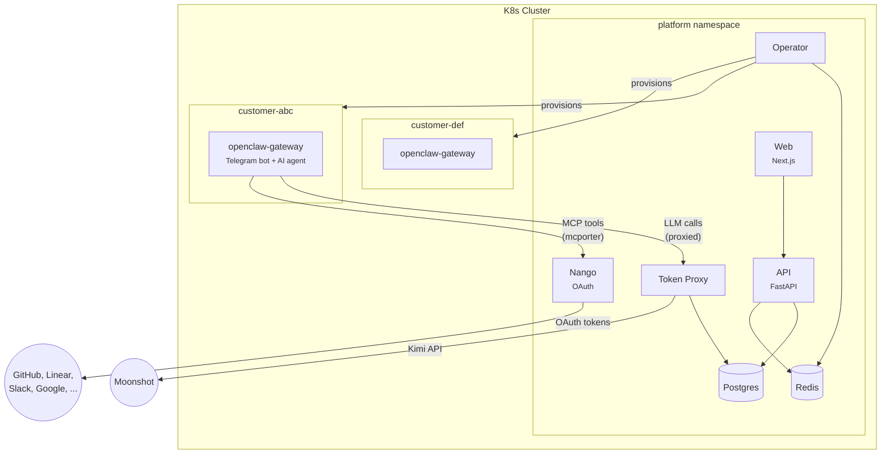
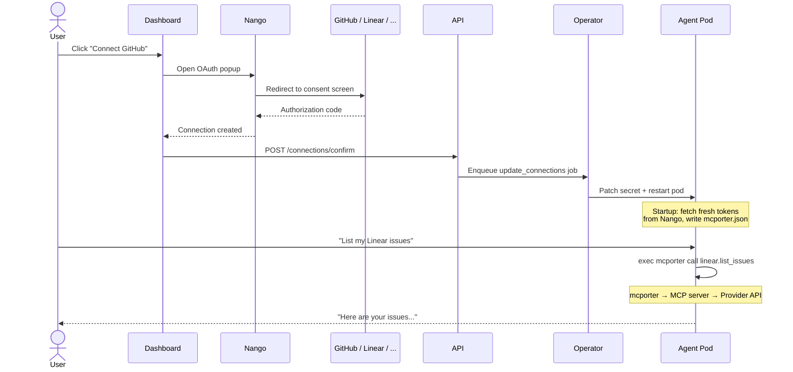

# openclaw-cloud

**Your AI agent. Zero setup. One Telegram chat away.**

A managed platform that gives every customer their own personal AI agent — fully isolated in a Kubernetes pod, accessible via Telegram, provisioned in seconds. Agents connect to external services (GitHub, Linear, Slack, Google Drive, Notion, Jira) through OAuth with automatic token refresh, and interact with them using structured MCP tools instead of raw API calls.

---

## How it works

```
Chat → Pay → Code
```

1. Customer talks to the onboarding agent — no forms, no config files
2. Picks a plan, checks out with Stripe in 30 seconds
3. A dedicated [OpenClaw](https://openclaw.ai) gateway pod spins up on Kubernetes
4. Their Telegram bot goes live — a personal AI coding agent, ready to go

Each customer gets full isolation: own K8s namespace, resource quotas, network policies. Customer pods never hold real API keys — LLM calls route through a token proxy with per-customer metering and rate limits.

## Architecture



### Services

| Service | Stack | Role |
|---|---|---|
| **api** | FastAPI + SQLAlchemy | REST API — auth, provisioning, connections, usage tracking |
| **operator** | Python + Redis BLPOP | Job queue consumer — creates/manages K8s resources per customer |
| **token-proxy** | Node.js | Transparent LLM proxy — per-customer auth, rate limits, token quotas, usage metering |
| **web** | Next.js 14 + Tailwind + shadcn/ui | Landing page, onboarding, customer dashboard, OAuth flows, admin panel |
| **nango-server** | Nango (self-hosted) | OAuth lifecycle — token storage, automatic refresh, encrypted credentials, proxy |
| **postgres** | PostgreSQL | All persistent data |
| **redis** | Redis | Job queue, rate limiting, caching, usage event stream |

### Per-customer resources

Every customer gets their own K8s namespace containing:

- **openclaw-gateway** pod — the AI agent (Telegram bot + LLM + MCP tools)
- **openclaw-config** Secret — bot token, proxy API key, model config, connection credentials
- **ResourceQuota** — CPU/memory limits enforced per tier
- **NetworkPolicy** — egress restricted to token-proxy, nango-server, and Telegram only

## External service integrations

Agents access external services through [MCP](https://modelcontextprotocol.io) (Model Context Protocol) servers via [mcporter](https://github.com/steipete/mcporter). Instead of crafting raw API calls, the agent uses structured tools like `mcporter call linear.list_issues` or `mcporter call github.search_repos`.

OAuth is handled by a self-hosted [Nango](https://nango.dev) instance. Tokens are fetched fresh from Nango at pod startup and injected into the mcporter config — no tokens stored on disk, automatic refresh on every restart.



### Supported providers

| Provider | MCP Server | Tools |
|---|---|---|
| **Linear** | `mcp.linear.app/sse` (hosted) | Issues, projects, cycles, comments |
| **GitHub** | `@anthropic/github-mcp-server` | Repos, issues, PRs, code search |
| **Notion** | `@notionhq/notion-mcp-server` | Pages, databases, blocks, search |
| **Slack** | `@anthropic/slack-mcp-server` | Messages, channels, users |
| **Jira** | `mcp-atlassian` | Issues, projects, boards |
| **Google** | `@anthropic/google-drive-mcp` | Drive, Sheets, Calendar |

600+ more providers available through Nango. Adding a new one requires only a Nango integration config and an MCP server entry in `providers.py`.

### Runtime connection requests

If a user asks the agent to access a service that isn't connected yet, the agent generates a deep link (`/connect/<provider>?token=...`) and sends it via Telegram. The user authorizes in their browser, and the agent picks up the new connection on next pod restart.

## Token proxy

Customer pods never hold real LLM API keys. All inference calls go through the token proxy, which:

- Authenticates per-customer proxy tokens (bcrypt-hashed, Redis-cached)
- Enforces rate limits (token bucket, 10 req/s per customer)
- Checks monthly token quotas before forwarding
- Proxies to the upstream LLM provider (Moonshot/Kimi)
- Meters usage per-request (Redis stream → batch Postgres writes)

## Pricing tiers

| | Starter | Pro | Team |
|---|---|---|---|
| **Price** | $19/mo | $49/mo | $129/mo |
| **Tokens** | 1M/mo | 5M/mo | 20M/mo |
| **Telegram users** | 1 | 1 | Up to 10 |
| **Thinking level** | Medium | Medium | High |
| **CPU** | 250m–1000m | 500m–2000m | 1000m–4000m |
| **Memory** | 512Mi–1Gi | 512Mi–1Gi | 1Gi–2Gi |

## Tech stack

| Layer | Technology |
|---|---|
| **Orchestration** | K3s (prod) / k3d (local) — everything runs in-cluster |
| **Infrastructure** | Nix flake — Colmena (node management), kubenix (typed K8s manifests), nix2container (OCI images) |
| **Secrets** | SOPS + age |
| **API** | FastAPI + SQLAlchemy (async) + Pydantic |
| **Frontend** | Next.js 14 + Tailwind CSS + shadcn/ui |
| **LLM proxy** | Node.js + pi-ai (provider abstraction) |
| **OAuth** | Nango (self-hosted) |
| **MCP tooling** | mcporter + per-provider MCP servers |
| **AI model** | Kimi Code (kimi-coding/k2p5) via Moonshot API |
| **Cloud** | Hetzner Cloud + ghcr.io |

## Local development

All services run inside a local k3d cluster, matching production architecture exactly. Docker Compose is only used for building images.

```bash
# Prerequisites: Nix (with flakes), Docker, k3d

git clone git@github.com:andreabadesso/openclaw-cloud.git
cd openclaw-cloud
nix develop    # dev shell with kubectl, k9s, colmena, sops, etc.

# Bootstrap everything (k3d cluster + build + deploy all services)
./scripts/dev-setup.sh

# Rebuild a single service after code changes
./scripts/dev-import.sh api        # or: operator, token-proxy, web

# Build the gateway image separately (nix2container, ~7GB)
nix build .#openclaw-image.copyTo
result/bin/copy-to docker-archive:/tmp/oc.tar:ghcr.io/andreabadesso/openclaw-cloud/openclaw-gateway:latest
docker load -i /tmp/oc.tar
k3d image import ghcr.io/andreabadesso/openclaw-cloud/openclaw-gateway:latest -c openclaw-dev
```

### Local URLs

| URL | Service |
|---|---|
| `http://localhost:3000` | Web (landing, dashboard, admin) |
| `http://localhost:8000` | API |
| `http://localhost:3003` | Nango admin dashboard |
| `http://localhost:8080` | Token proxy |
| `localhost:5432` | PostgreSQL |

### Provision a test instance

From the admin panel at `/admin`, or via curl:

```bash
curl -X POST http://localhost:8000/internal/provision \
  -H "Content-Type: application/json" \
  -d '{
    "customer_email": "user@example.com",
    "telegram_bot_token": "123456:ABC-DEF...",
    "telegram_user_id": 123456789,
    "tier": "starter",
    "model": "kimi-coding/k2p5"
  }'
```

## Production deployment

- **Nodes**: NixOS on Hetzner Cloud, managed declaratively with `colmena apply`
- **K8s manifests**: Generated from Nix via kubenix — `nix build .#k8s-manifests` → `kubectl apply`
- **Images**: nix2container (gateway) + Docker Compose (platform services) → pushed to ghcr.io
- **Secrets**: SOPS-encrypted with age keys

## Project structure

```
apps/
  api/                  # FastAPI — REST API
  operator/             # Python — K8s resource manager (Redis job queue)
  token-proxy/          # Node.js — LLM proxy with auth + metering
  web/                  # Next.js — frontend
images/
  openclaw-gateway.nix  # nix2container image for customer pods
k8s/
  services/             # kubenix manifests (api, web, operator, nango, etc.)
  infrastructure/       # kubenix manifests (postgres, redis, ingress)
  local/                # k3d-specific configs (nodeports)
nodes/                  # Colmena NixOS node configs
scripts/                # dev-setup.sh, dev-import.sh
db/
  migrations/           # SQL migrations
docs/                   # Technical design documents
```

## Roadmap

- [x] Core platform (API, operator, token proxy, web)
- [x] K8s pod lifecycle (provision, suspend, reactivate, destroy, resize)
- [x] Nango OAuth integrations (6 providers)
- [x] MCP tool access via mcporter (replaces raw curl)
- [x] All services in-cluster (k3d local, K3s prod)
- [ ] JWT RS256 authentication
- [ ] Stripe billing integration
- [ ] Conversational onboarding agent
- [ ] Health monitoring + auto-restart
- [ ] Production deployment (Hetzner)

## License

Proprietary. All rights reserved.
