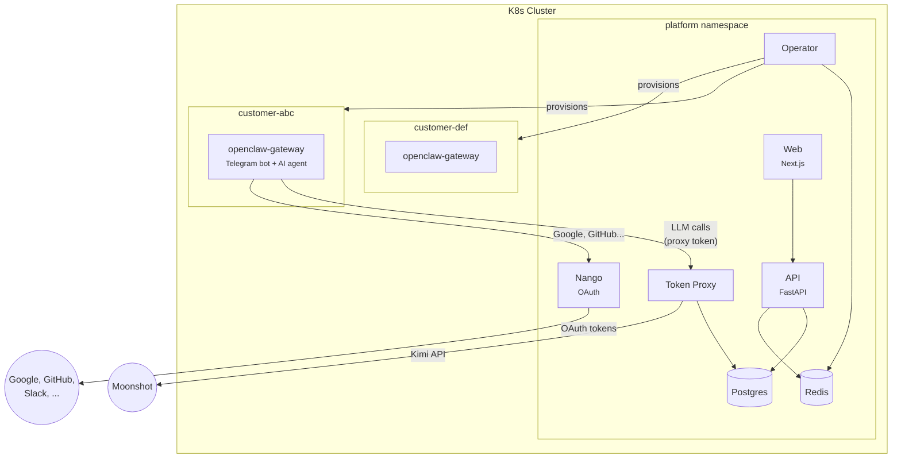
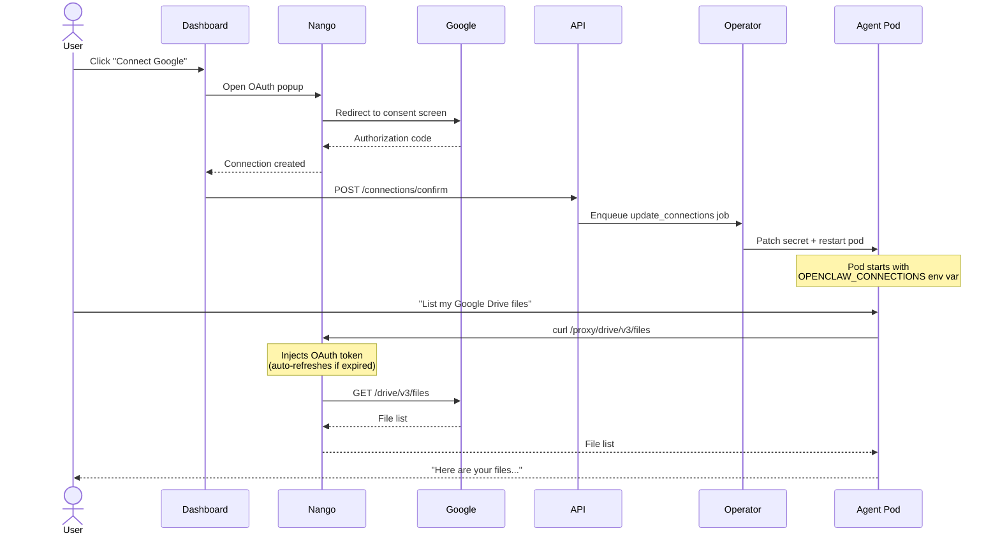

# openclaw-cloud

**One chat. One agent. Zero setup.**

A managed platform that gives every customer their own personal AI agent — isolated in a Kubernetes pod, accessible via Telegram, provisioned in seconds. Agents can connect to external services (Google Drive, GitHub, Slack, etc.) through OAuth, with automatic token refresh handled by [Nango](https://nango.dev).

## What it does

1. Customer signs up and provides their Telegram bot token
2. Platform provisions a dedicated K8s namespace with an [OpenClaw](https://openclaw.ai) gateway pod
3. Customer's Telegram bot goes live within seconds
4. Customer connects external services (Google, GitHub, Slack, etc.) via OAuth
5. Agent calls external APIs through the Nango proxy — tokens refresh automatically



Each customer is fully isolated: own namespace, resource quota, network policy. Customer pods never hold real API keys — LLM calls go through the token proxy with per-customer metering and rate limits.

## OAuth integrations (Nango)

Agents can access external services on behalf of the user. This is powered by a self-hosted [Nango](https://nango.dev) instance that handles the entire OAuth lifecycle:



Supported providers: **Google** (Drive, Sheets, Calendar), **GitHub**, **Slack**, **Linear**, **Notion**, **Jira** — with 600+ more available through Nango.

Agents can also request new connections at runtime. If a user asks the agent to access a service that isn't connected, the agent generates a deep link (`/connect/<provider>?token=...`) and sends it via Telegram. The user authorizes in their browser, and the agent picks up the new connection on next restart.

## Services

| Service | Purpose |
|---|---|
| **api** (FastAPI) | REST API — auth, provisioning, connections, usage |
| **operator** (Python) | Watches Redis queue, creates/manages K8s resources per customer |
| **token-proxy** (FastAPI) | Proxies LLM API calls with per-customer tokens, metering, rate limits |
| **web** (Next.js) | Landing page, admin panel, customer dashboard, OAuth flows |
| **nango-server** | Self-hosted OAuth proxy — token storage, refresh, encrypted credentials |
| **postgres** | All data — customers, subscriptions, connections, usage, jobs |
| **redis** | Job queue, rate limiting, caching |

## Tech stack

| | |
|---|---|
| **Orchestration** | K3s (prod) / k3d (local) — all services in-cluster |
| **Infrastructure as code** | Nix flake — Colmena (nodes), kubenix (manifests), nix2container (images) |
| **AI backend** | Kimi Code (kimi-coding/k2p5) via Moonshot API |
| **API** | FastAPI + SQLAlchemy + Pydantic |
| **Frontend** | Next.js 14 + Tailwind + shadcn/ui |
| **OAuth** | Nango (self-hosted) |
| **Cloud** | Hetzner Cloud |

## Local development

All services run inside a local k3d cluster, matching production architecture. Docker Compose is only used for building images.

```bash
# Prerequisites: Nix (with flakes), Docker, k3d

git clone git@github.com:andreabadesso/openclaw-cloud.git
cd openclaw-cloud
nix develop

# Bootstrap everything (k3d cluster + build + deploy)
./scripts/dev-setup.sh

# Build the gateway image (nix2container, ~7GB)
nix build .#openclaw-image.copyTo
result/bin/copy-to docker-archive:/tmp/oc.tar:ghcr.io/andreabadesso/openclaw-cloud/openclaw-gateway:latest
docker load -i /tmp/oc.tar
k3d image import ghcr.io/andreabadesso/openclaw-cloud/openclaw-gateway:latest -c openclaw-dev
rm /tmp/oc.tar

# Rebuild a single service after code changes
./scripts/dev-import.sh api  # or: operator, token-proxy, web
```

| URL | Service |
|---|---|
| http://localhost:3000 | Web (landing, admin, dashboard) |
| http://localhost:8000 | API |
| http://localhost:3003 | Nango admin |
| http://localhost:8080 | Token proxy |
| localhost:5432 | PostgreSQL |

Provision a test instance from the admin panel at `/admin` or via curl:

```bash
curl -X POST http://localhost:8000/internal/provision \
  -H "Content-Type: application/json" \
  -d '{
    "customer_email": "user@example.com",
    "telegram_bot_token": "123456:ABC-DEF...",
    "telegram_user_id": 123456789,
    "tier": "starter",
    "model": "kimi-coding/k2p5"
  }'
```

## Roadmap

- [x] Core platform (API, operator, token proxy, web)
- [x] K8s pod lifecycle (provision, suspend, reactivate, destroy, resize)
- [x] Nango OAuth integrations + agent proxy access
- [x] All services in-cluster (k3d local, K3s prod)
- [ ] JWT RS256 authentication
- [ ] Stripe billing
- [ ] Conversational onboarding agent
- [ ] Health monitoring + auto-restart
- [ ] Production deployment (Hetzner)

## License

Proprietary. All rights reserved.
