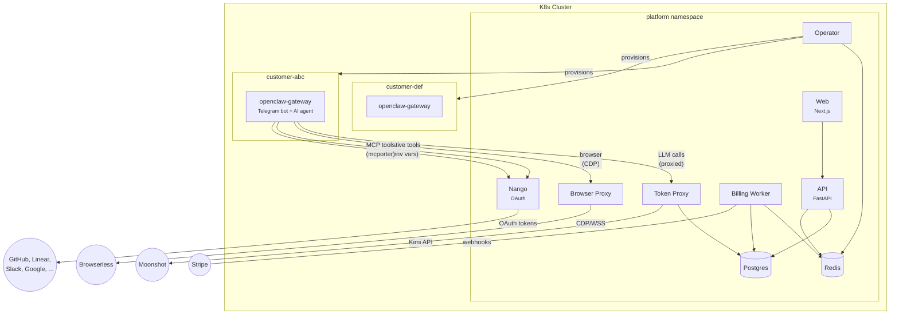

# openclaw-cloud

**Agentes de IA especializados. Para o seu nicho.**

A managed platform that gives every customer a **niche-specific AI agent** — fully isolated in a Kubernetes pod, accessible via Telegram, provisioned in seconds. Choose a specialized agent for your industry (pharmacy, legal, real estate, accounting), connect your apps via OAuth, and start working immediately.

The first vertical is **Pharmacy (Farmacia)** — a Portuguese-speaking assistant trained on pharmaceutical knowledge, helping with drug interaction lookups, inventory management, customer service, and management system integration.

---

## How it works

```
Escolha → Assine → Use
```

1. Customer picks a niche agent from the marketplace (or gets recommended one during onboarding)
2. Picks a plan, checks out with Stripe in 30 seconds
3. A dedicated [OpenClaw](https://openclaw.ai) gateway pod spins up on Kubernetes with the niche-specific system prompt
4. Their Telegram bot goes live — a specialized AI agent, ready to go

Each customer gets full isolation: own K8s namespace, resource quotas, network policies. Customer pods never hold real API keys — LLM calls route through a token proxy with per-customer metering and rate limits.

## Niches

| Niche | Status | Agent Focus |
|---|---|---|
| **Farmacia** 💊 | Active | Drug interactions, inventory, customer service, management systems |
| **Juridico** ⚖️ | Coming soon | Case law, legal drafting, deadline management |
| **Imobiliario** 🏠 | Coming soon | Leads, property listings, market analysis |
| **Contabilidade** 📊 | Coming soon | Entry classification, bank reconciliation, tax obligations |

Each niche defines a specialized system prompt injected into the agent pod as `OPENCLAW_SYSTEM_PROMPT`. The agent uses this prompt to tailor its behavior, language, and domain knowledge.

## i18n

The web frontend uses [next-intl](https://next-intl.dev) with Portuguese (BR) as the default locale and English as secondary. All landing page content, niche descriptions, pricing, and CTAs are fully translated.

- Default: `/pt` (Portuguese BR)
- English: `/en`
- Language toggle in header

## Architecture



### Services

| Service | Stack | Role |
|---|---|---|
| **api** | FastAPI + SQLAlchemy | REST API — auth, provisioning, connections, billing portal, usage tracking |
| **operator** | Python + Redis BLPOP | Job queue consumer — creates/manages K8s resources per customer |
| **billing-worker** | FastAPI + Stripe | Stripe webhook processor — handles checkout, payments, tier changes, cancellations |
| **token-proxy** | Node.js + pi-ai | Transparent LLM proxy — per-customer auth, rate limits, token quotas, usage metering |
| **browser-proxy** | Node.js + ws | CDP proxy to Browserless — per-customer browser sessions with auth, concurrency limits, usage tracking |
| **web** | Next.js 14 + Tailwind + next-intl | Landing page (niche marketplace), onboarding, customer dashboard, OAuth flows, admin panel |
| **nango-server** | Nango (self-hosted) | OAuth lifecycle — token storage, automatic refresh, encrypted credentials, proxy |
| **postgres** | PostgreSQL | All persistent data |
| **redis** | Redis | Job queue, rate limiting, caching, usage event stream |

### Per-customer resources

Every customer gets their own K8s namespace containing:

- **openclaw-gateway** pod — the AI agent (Telegram bot + LLM + native tools + MCP tools + browser + niche system prompt)
- **openclaw-config** Secret — bot token, proxy API key, model config, connection credentials, browser proxy URL, system prompt
- **ResourceQuota** — CPU/memory limits enforced per tier
- **NetworkPolicy** — egress restricted to token-proxy, browser-proxy, nango-server, API, and Telegram only

## External service integrations

Agents access external services through two mechanisms, depending on the provider:

**Native integrations** — GitHub, Notion, Slack use openclaw's built-in tools and skills. OAuth tokens from Nango are injected as environment variables (`GH_TOKEN`, `NOTION_API_KEY`, `SLACK_BOT_TOKEN`) at pod startup. The agent uses these automatically with no extra configuration.

**MCP integrations** — Linear, Jira, Google use [MCP](https://modelcontextprotocol.io) servers via [mcporter](https://github.com/steipete/mcporter). The agent uses structured tool calls like `mcporter call linear.list_issues` instead of raw API requests.

OAuth for all providers is handled by a self-hosted [Nango](https://nango.dev) instance. Tokens are fetched fresh at pod startup — no tokens stored on disk, automatic refresh on every restart.

### Supported providers

| Provider | Type | How it works |
|---|---|---|
| **GitHub** | Native | `GH_TOKEN` env var → openclaw's built-in `gh` CLI skill |
| **Notion** | Native | `NOTION_API_KEY` env var → openclaw's built-in Notion skill |
| **Slack** | Native | `SLACK_BOT_TOKEN` env var → openclaw's built-in Slack actions |
| **Linear** | MCP | `mcp.linear.app/sse` (hosted HTTP) via mcporter |
| **Jira** | MCP | `mcp-atlassian` (stdio) via mcporter |
| **Google** | MCP | `@anthropic/google-drive-mcp` (stdio) via mcporter |

600+ more providers available through Nango.

## Token proxy

Customer pods never hold real LLM API keys. All inference calls go through the token proxy, which:

- Authenticates per-customer proxy tokens (bcrypt-hashed, Redis-cached)
- Enforces rate limits (token bucket, 10 req/s per customer)
- Checks monthly token quotas before forwarding
- Proxies to the upstream LLM provider (Moonshot/Kimi)
- Meters usage per-request (Redis stream → batch Postgres writes)

## Browser proxy

Every agent pod can browse the web through a shared [Browserless](https://browserless.io) instance, proxied through the browser-proxy service. The architecture mirrors the token proxy:

- Agent pods never hold the Browserless API key
- The proxy authenticates pods using their existing proxy token (embedded as Basic auth in the CDP URL)
- HTTP `/json/*` discovery requests are forwarded with URL rewriting (WebSocket URLs point back through the proxy)
- WebSocket CDP connections are piped bidirectionally between the pod and Browserless
- Per-customer session limits (max 2 concurrent) and max duration (10 min) are enforced
- Session usage is tracked in Postgres (`browser_sessions` table)

The gateway reads `OPENCLAW_BROWSER_PROXY_URL` from its environment and configures a `cloud` browser profile automatically.

## Billing

Stripe handles all payment processing. The billing flow is fully automated:

1. **Checkout** → `billing-worker` receives `checkout.session.completed` → creates subscription → enqueues provision job
2. **Monthly renewal** → `invoice.payment_succeeded` → resets token counter, reactivates if suspended
3. **Payment failure** → `invoice.payment_failed` → suspends pod after 3 failed attempts
4. **Tier change** → `customer.subscription.updated` → enqueues resize job (adjusts quotas + resources)
5. **Cancellation** → `customer.subscription.deleted` → enqueues destroy job

## Pricing tiers

| | Starter | Pro | Team |
|---|---|---|---|
| **Price** | $19/mo | $49/mo | $129/mo |
| **Tokens** | 1M/mo | 5M/mo | 20M/mo |
| **Telegram users** | 1 | 1 | Up to 10 |
| **Thinking level** | Medium | Medium | High |
| **CPU** | 250m–1000m | 500m–2000m | 1000m–4000m |
| **Memory** | 512Mi–1Gi | 512Mi–1Gi | 1Gi–2Gi |

## Tech stack

| Layer | Technology |
|---|---|
| **Orchestration** | K3s (prod) / k3d (local) — everything runs in-cluster |
| **Infrastructure** | Nix flake — Colmena (node management), kubenix (typed K8s manifests), nix2container (OCI images) |
| **Secrets** | SOPS + age |
| **API** | FastAPI + SQLAlchemy (async) + Pydantic |
| **Frontend** | Next.js 14 + Tailwind CSS + shadcn/ui + next-intl (PT-BR default, EN) |
| **LLM proxy** | Node.js + pi-ai (provider abstraction) |
| **Browser proxy** | Node.js + ws (CDP WebSocket proxy to Browserless) |
| **Billing** | Stripe (webhooks → billing-worker) |
| **OAuth** | Nango (self-hosted) |
| **MCP tooling** | mcporter (Linear, Jira, Google) + native openclaw tools (GitHub, Notion, Slack) |
| **AI model** | Kimi Code (kimi-coding/k2p5) via Moonshot API |
| **CI/CD** | GitHub Actions (tests + Docker builds) |
| **Cloud** | Hetzner Cloud + ghcr.io |

## Testing

255 tests across all services, run in CI on every push:

```bash
# API (68 tests) — SQLite in-memory, full route coverage
cd apps/api && pip install -e ".[test]" && pytest

# Operator (85 tests) — mocked K8s + Redis, all job handlers
cd apps/operator && pip install -e ".[test]" && pytest

# Billing Worker (23 tests) — mocked Stripe events, all webhook handlers
cd apps/billing-worker && pip install -e ".[dev]" && pytest

# Token Proxy (66 tests) — streaming + non-streaming proxy, context conversion
cd apps/token-proxy && npm ci && npm test

# Browser Proxy (13 tests) — WS proxy, URL rewriting, auth, session limits
cd apps/browser-proxy && npm ci && npm test
```

## Local development

All services run inside a local k3d cluster, matching production architecture exactly. Docker Compose is only used for building images.

```bash
# Prerequisites: Nix (with flakes), Docker, k3d

git clone git@github.com:andreabadesso/openclaw-cloud.git
cd openclaw-cloud
nix develop    # dev shell with kubectl, k9s, colmena, sops, etc.

# Bootstrap everything (k3d cluster + build + deploy all services)
./scripts/dev-setup.sh

# Rebuild a single service after code changes
./scripts/dev-import.sh api        # or: operator, token-proxy, web

# Build the gateway image separately (nix2container, ~7GB)
nix build .#openclaw-image.copyTo
result/bin/copy-to docker-archive:/tmp/oc.tar:ghcr.io/andreabadesso/openclaw-cloud/openclaw-gateway:latest
docker load -i /tmp/oc.tar
k3d image import ghcr.io/andreabadesso/openclaw-cloud/openclaw-gateway:latest -c openclaw-dev
```

### Local URLs

| URL | Service |
|---|---|
| `http://localhost:3000` | Web (landing, dashboard, admin) — redirects to `/pt` |
| `http://localhost:3000/en` | English version |
| `http://localhost:8000` | API |
| `http://localhost:3003` | Nango admin dashboard |
| `http://localhost:8080` | Token proxy |
| `localhost:5432` | PostgreSQL |

### Provision a test instance

From the admin panel at `/pt/admin`, or via curl:

```bash
curl -X POST http://localhost:8000/internal/provision \
  -H "Content-Type: application/json" \
  -d '{
    "customer_email": "user@example.com",
    "telegram_bot_token": "123456:ABC-DEF...",
    "telegram_user_id": 123456789,
    "tier": "starter",
    "model": "kimi-coding/k2p5",
    "niche": "pharmacy"
  }'
```

## Project structure

```
apps/
  api/                  # FastAPI — REST API (with niches.py)
  operator/             # Python — K8s resource manager (with niches.py)
  billing-worker/       # FastAPI — Stripe webhook processor
  token-proxy/          # Node.js — LLM proxy with auth + metering
  browser-proxy/        # Node.js — CDP proxy to Browserless with auth + session tracking
  web/                  # Next.js — frontend (i18n: pt/en)
    messages/           # Translation files (pt.json, en.json)
    src/i18n/           # next-intl routing, request config, navigation
    src/app/[locale]/   # All pages under locale prefix
images/
  openclaw-gateway.nix  # nix2container image for customer pods
k8s/
  services/             # kubenix manifests (api, web, operator, nango, etc.)
  infrastructure/       # kubenix manifests (postgres, redis, ingress)
  local/                # k3d-specific configs (nodeports)
nodes/                  # Colmena NixOS node configs
scripts/                # dev-setup.sh, dev-import.sh
db/
  migrations/           # SQL migrations (003_niches.sql adds niche column)
docs/                   # Technical design documents
.github/
  workflows/ci.yml      # Tests + Docker builds on push/PR
```

## Roadmap

- [x] Core platform (API, operator, token proxy, web)
- [x] K8s pod lifecycle (provision, suspend, reactivate, destroy, resize)
- [x] Nango OAuth integrations (6 providers)
- [x] Native tool access for GitHub, Notion, Slack (env var injection)
- [x] MCP tool access via mcporter for Linear, Jira, Google
- [x] Stripe billing integration (billing-worker + webhook handlers)
- [x] CI pipeline (GitHub Actions — tests + Docker builds)
- [x] All services in-cluster (k3d local, K3s prod)
- [x] Browser access via CDP proxy to Browserless
- [x] Niche agent marketplace (pharmacy first)
- [x] i18n (Portuguese BR default, English)
- [x] Niche system prompt injection into gateway pods
- [ ] JWT RS256 authentication
- [ ] Conversational onboarding agent
- [ ] Additional niches (legal, real estate, accounting)
- [ ] Health monitoring + auto-restart
- [ ] Production deployment (Hetzner)

## License

Proprietary. All rights reserved.
